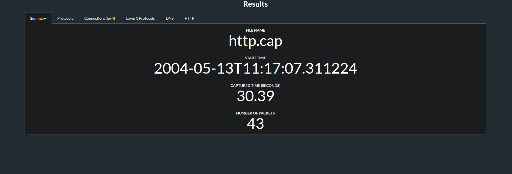
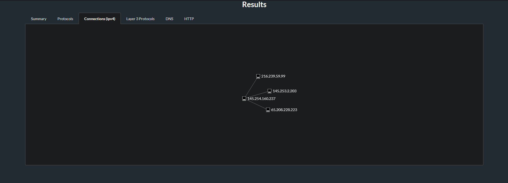
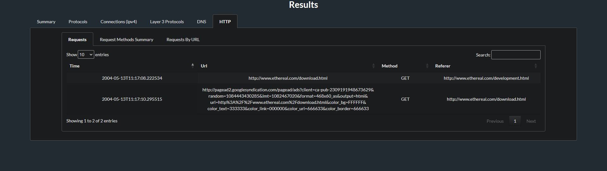
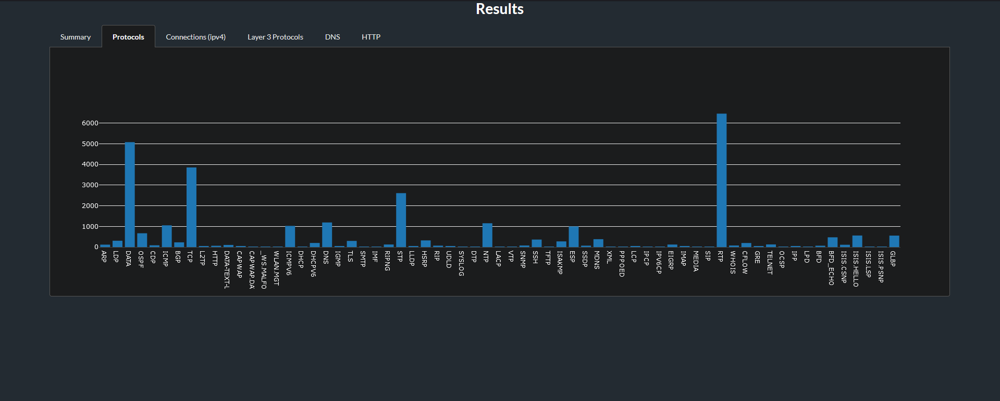
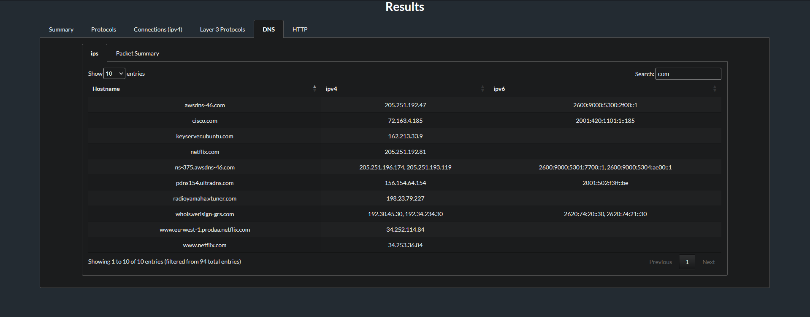

# UPDOG

Understanding PCAPs with Data Or Graphs

UPDOG is a tool for getting a high level overview of a PCAP, to draw attention
to potential areas of interest.

## What's UPDOG?

Not much, how about you?

## Quick start

```sh
python3 -m venv venv
. ./venv/bin/activate
pip3 install -r requirements.txt
sudo apt install tshark
pre-commit install
```

## Usage

To generate JSON and html views of the pcap `my_pcap.pcapng`, simply run the
following command.

```sh
python3 updog_cli.py -i my_pcap.pcapng -o output.json --output-html output.html
```

## Example output

### HTTP.cap

Example output generated using the HTTP.cap example pcap from
https://wiki.wireshark.org/SampleCaptures.

#### Summary page



#### Connections graph


#### HTTP table



### ultimate_wireshark_protocols_pcap_220213.pcap

Example output generated using a subset of the
ultimate_wireshark_protocols_pcap_220213.pcap example pcap from
https://wiki.wireshark.org/SampleCaptures.

#### Protocols graph



#### DNS table



## Use cases

As it says above, the main goal of UPDOG is to be able to generate a high level
overview of a PCAP, to draw attention to potential areas of interest. This can
be useful for a variety of reasons, some of these are outlined below:

-  Looking for patterns in your home network traffic.
-  Looking at network traffic when performing software reverse engineering.
-  Looking for potential attack surface when performing vulnerability research.
-  Looking for repeatedly used URLs in HTTP traffic.
